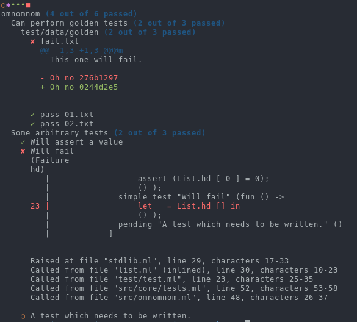

# Omnomnom

An OCaml test framework inspired by [Tasty][tasty].

<p align="center">

</p>

## What?
Omnomnom is another test framework, in the likes of [ounit][ounit] or
[alcotest][alcotest]. If you're looking for a more stable, battle-tested
framework, I'd highly recommend checking those out.

However, Omnomnom's primary goal is not to provide all mechanisms for writing
tests (such as fancy assertion systems), but rather a way to mix multiple styles
of tests, from different frameworks together, while providing as much
extensibility as possible.

Omnomnom test suites are built from two components: tests and ingredients. Both
of these can be configured via a [Cmdliner][cmdliner] term, meaning it's easy to
modify behaviour via the command line.

Tests, as one may expect, are pretty basic - they define the options this test
takes, and the method to run for this test. Ingredients are all the other stuff
which goes on as part of a test execution cycle - test filters, reporters, or
custom runners. It's trivial to mix and match these, to get the exact behaviour
you need.

## Usage
Using omnomnom should be as simple as depending on the `omnomnom` library,
opening `Omnomnom.test` and writing some tests! From there, you can build a a
test tree and use `Omnomnom.run` to execute it.

```ocaml
open Omnomnom.Tests

let () = Omnomnom.run @@ group "omnomnom"
  [ simple_test "Will assert a value" (fun () ->
        assert (List.hd [ 0 ] = 0);
        ());
    simple_test "Will fail" (fun () ->
        let _ = List.hd [] in
        ());
    pending "A test which needs to be written." ()
  ]
```

For more complete examples, I'd recommend checkout out [our somewhat lacklustre
test suite][test_suite].

Please note that, due to the fact that Omnomnom is still a work-in-progress, it
is not currently available on Opam. As a result you must build and install it
manually (which can just be done with `dune build @install; dune install`).

## Features and roadmap
Omnomnom was knocked together in a weekend, and tidied up the week
afterwards. As a result, it's still missing a lot of features that one might
consider critical to a test framework.

### Ingredients
 - [x] A fancy console reporter, with support for colours.
 - [ ] Test filters: both test paths and a include/exclude tag mechanism.
 - [ ] Test listing
 - [ ] Rerun failed tests
 - [x] JUnit test reporter.
 - [ ] Test Anything Protocol reporter.

### Test integration
 - [x] Alcotest support
 - [ ] OUnit support
 - [x] QCheck support

[tasty]: https://github.com/feuerbach/tasty "Modern and extensible testing framework for Haskell"
[alcotest]: https://github.com/mirage/alcotest/ "A lightweight and colourful test framework"
[ounit]: https://github.com/gildor478/ounit "Unit testing framework loosely based on HUnit."
[cmdliner]: https://erratique.ch/software/cmdliner "Cmdliner allows the declarative definition of command line interfaces in OCaml."
[test_suite]: https://github.com/SquidDev/omnomnom/tree/master/test "Omnomnom's test suite."
